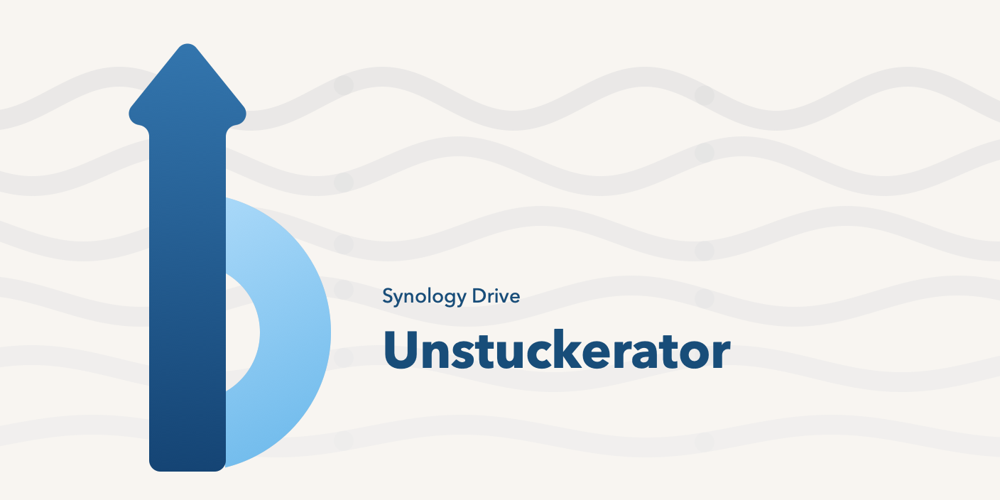

# Synology Drive Unstuckerator



Synology Drive Unstuckerator is a menu-bar utility for macOS. It watches folders you choose inside Synology Drive, records permanent File Provider upload failures, and can publish one verified retry copy of a file that Synology has stopped uploading.

The name, mark, and colors are in [docs/brand.md](docs/brand.md).

This project is not affiliated with Synology Inc. Synology, Synology Drive, and related marks belong to their owners.

## What it does

Synology Drive's File Provider sometimes leaves a file in a permanent upload failure (`NSFileProviderErrorDomain`, code `-2005`). The file is on disk and marked downloaded, but Drive does not finish the upload. Finder's Retry is not one of the documented reset conditions.

Synology Drive Unstuckerator:

1. Walks each watched folder, including nested folders, and asks `fileproviderctl evaluate` about eligible files that changed recently.
2. Treats a file as needing attention only after two matching checks at least 60 seconds apart. A single `isUploading` flag is not treated as a failure.
3. Lets you press **Fix** on that file. Fix tries a same-volume clone (APFS copy-on-write), falling back to a full copy only when the disk-space plan allows it, compares the SHA-256 of the source and the staged copy, and publishes one sibling next to the original.
4. Waits until Synology reports that sibling uploaded and the upload error is gone.
5. Moves the failed original into a local undo cache for 6 hours, then renames the uploaded sibling to the original name. If you quit while Synology is still uploading that sibling, the next **Check upload** verifies the same sibling instead of publishing another copy.
6. Offers **Undo** during those 6 hours. Undo puts the archived original back and parks the replacement beside it in the cache.

Nothing is removed before Synology reports the replacement uploaded. The original is not overwritten in place.

Monitoring is automatic. In this build you start each repair yourself with **Fix**; automatic requeue is not available yet. Files that were already failing when monitoring started are listed for review rather than retried.

## Requirements

- macOS 15 or later. Liquid Glass controls are used on macOS 26 and later; earlier systems get a solid fallback.
- The Synology Drive client, with the folder available as a File Provider volume under `~/Library/CloudStorage`.
- Swift 6.2 or later, and Xcode 26 or later, to build from source. The app still runs on macOS 15. Liquid Glass is behind an availability check, and those symbols come from the macOS 26 SDK.

The app is a menu-bar item. It is not sandboxed and it is not distributed through the App Store. It does not phone home.

## Download

The current build is on the [releases page](https://github.com/michaelsantos00/synology-drive-unstuckerator/releases). It is an Apple silicon app for macOS 15 or later, ad-hoc signed, and not notarized.

1. Download the macOS zip from the releases page and open it.
2. Move `Synology Drive Unstuckerator.app` to your Applications folder.
3. The first time you open it, macOS blocks it because this build is ad-hoc signed and not notarized. Allow it once: open **System Settings > Privacy & Security**, scroll to the Security section, click **Open Anyway**, then confirm with **Open**. The older Control-click > Open shortcut no longer works on macOS 15 and later.

## Build and run the tests

```bash
swift test
```

## Build a local app

```bash
Scripts/package-app.sh
```

That builds a release binary, assembles `Synology Drive Unstuckerator.app` in `~/Applications`, ad-hoc signs it, and opens it. Pass another destination if you want the bundle somewhere else:

```bash
Scripts/package-app.sh "$HOME/Desktop/Synology Drive Unstuckerator.app"
```

The first open after signing sometimes fails with a launch-services error. The script opens the app a second time.

Quit the menu-bar app from its power button, or with:

```bash
osascript -e 'tell application "Synology Drive Unstuckerator" to quit'
```

Do not signal `fileproviderd`, `cloud-drive-eventd`, or any other Synology process. Those are not part of this app.

## Using it

1. Open the menu and choose **Settings**.
2. Pick the Synology Drive folder to watch. The scan includes every nested folder under that root.
3. Choose which kinds of files to inspect (video, archives, PDF, and any extra extensions). Names containing `_segment_` stay ignored.
4. Press **Apply Monitoring Settings**.
5. **Scan Now** checks eligible files modified in the last 7 days. Files younger than the stability window are listed and checked again later. They are not dropped silently.
6. **Fix** runs only for the file on that row. **Reveal** shows it in Finder. **Dismiss** hides a handled row from the menu. **Undo** restores an original that is still inside the 6-hour cache.
7. **Reset** clears the discovered list and activity history on this Mac. It does not delete files in Synology Drive.

Launch at login is in Settings. macOS may ask you to approve the login item.

## Where data lives

All of this is outside the synced folder:

| Path | Contents |
| --- | --- |
| `~/Library/Application Support/Synology Drive Unstuckerator/Store` | Local finding history |
| `~/Library/Application Support/Synology Drive Unstuckerator/Staging` | Copies being prepared for publication |
| `~/Library/Application Support/Synology Drive Unstuckerator/Undo` | Originals kept for 6 hours after a successful fix |
| `~/Library/Application Support/Synology Drive Unstuckerator/Journals` | One JSON journal per fix attempt |
| `~/Library/Logs/Synology Drive Unstuckerator` | Local log |

The first launch under this name moves a folder left behind by an earlier name, `Unstuckerator` or `Synology Drive Monitor`, if that folder is still there. Removing the app does not remove the folder. Delete `~/Library/Application Support/Synology Drive Unstuckerator` yourself when you want the history and the undo cache gone. Do that only after you no longer need Undo.

## Safety limits

- The tool only runs `/usr/bin/fileproviderctl evaluate`. It does not run `fileproviderctl repair`.
- Exit code 0 from `evaluate` is not treated as "healthy". The parser reads the first `fileproviderItems` dictionary and fails closed on output it does not understand.
- A fix refuses to publish on insufficient free space. When the same-volume clone check passes, the required headroom is the configured reserve (20 GiB by default, floored at 1 GiB), because a clone does not need a second full copy of the bytes. Otherwise it requires at least the greater of twice the file size and the file size plus reserve. Cross-volume staging is blocked.
- The source and the staged copy are both SHA-256 hashed and compared before publication. This is not a checksum of the file on the NAS. A hash mismatch or a failed move stops the attempt and leaves the staged file in place for inspection; a cross-volume stage is blocked before staging begins.
- This repository must not be added as a watched root. It is source code, not a Drive library.

More detail is in [docs/safety.md](docs/safety.md) and [docs/architecture.md](docs/architecture.md).

## License

Source is published under the [PolyForm Noncommercial License 1.0.0](LICENSE.md). That is a **source-available** license, not an OSI-approved open source license, because it does not permit commercial use.

You may use, study, modify, and share this software for noncommercial purposes, including personal use, research, hobby projects, and use by schools, charities, public research organizations, and government institutions.

You may not use it for commercial gain. That includes selling it, hosting it as a paid service, or bundling it into a product you charge for. There is no separate commercial license.

Required Notice: Copyright Michael Santos (https://github.com/digitalinksol)

## Contributing

See [CONTRIBUTING.md](CONTRIBUTING.md).
